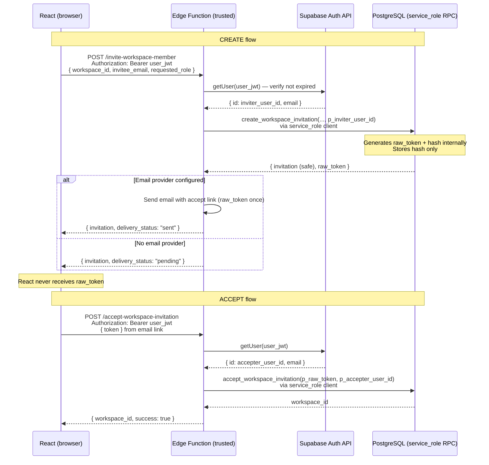

# Workspace Invitations Security Review — Mepa Ledger Stage 4B (Hardened)

**Status:** Review only — **do not apply** until explicitly approved.  
**Migration file:** `supabase/migrations/0002_workspace_invitations_functions.sql`  
**Prerequisite:** `0001_workspace_foundation.sql` already applied (project `ryobamnkdqpywlpfjwzo`)  
**Branch:** `feature/workspace-switching-invitations` (after commit `dbbea05`)  
**Stage scope:** Design and SQL draft only — no React invitation UI, no SQL apply, no Supabase connectivity, no test data.

---

## Purpose

The `workspace_invitations` table exists from Stage 2, but the applied foundation migration intentionally provides **no** invitation creation, acceptance, or revocation write functions. Direct browser writes are denied by RLS and missing INSERT/UPDATE grants.

This document defines an **enforceable** trusted server-side boundary. Token material must **never** pass through React or browser-executed PostgreSQL RPCs.

---

## Critical security boundary (corrected)

| Caller | Allowed PostgreSQL RPCs | Token material |
|--------|-------------------------|----------------|
| **Browser (authenticated Supabase client)** | `list_workspace_invitations`, `revoke_workspace_invitation` | **Never** receives or sends raw token or hash |
| **Supabase Edge Function (service_role server client)** | `create_workspace_invitation`, `accept_workspace_invitation` | Generates/stores hash; raw token stays server-side until optional email delivery |

**Explicit denials:**

- React must **not** call `supabase.rpc('create_workspace_invitation', …)` or `supabase.rpc('accept_workspace_invitation', …)`.
- Browser must **not** supply `p_token_hash`, `p_raw_token`, or any client-supplied actor user ID to PostgreSQL.
- `create_workspace_invitation` and `accept_workspace_invitation` are **`REVOKE ALL` from `authenticated`** and granted **`EXECUTE` to `service_role` only**.

---

## Problem statement

| Attempt | Result |
|---------|--------|
| Browser `insert` on `workspace_invitations` | **Denied** — no INSERT grant; no write RLS policies |
| Browser RPC `create_workspace_invitation` | **Denied after 0002** — not granted to `authenticated` |
| Browser RPC `accept_workspace_invitation` with token | **Denied after 0002** — not granted to `authenticated` |
| Browser RPC `list` / `revoke` | **Allowed** — safe return shapes only |
| Storing raw token in DB, audit metadata, or list responses | **Forbidden** |

---

## Two-client Edge Function boundary

Supabase **service_role** calls **do not preserve** the end-user's JWT context — `auth.uid()` is **NULL** inside PostgreSQL when using a service-role client alone. **Do not claim otherwise.**

### Required pattern (single Edge Function, one service_role client)



### Edge Function obligations

1. **Verify user JWT** with `supabase.auth.getUser(jwt)` (or equivalent) before any RPC.
2. Set `p_inviter_user_id` / `p_accepter_user_id` **only** from verified JWT `sub` — **never** from unauthenticated request body fields alone.
3. Use **service_role** Supabase client **only inside Edge Function** (server-side secret); never embed in React or Vite bundle.
4. Hold `raw_token` in memory only long enough for optional email delivery; **never** log it, return it to React, or store it in audit metadata.
5. Map PostgreSQL errors to **safe generic responses** at the Edge Function layer (see below).

### What NOT to do

| Anti-pattern | Why it fails |
|--------------|--------------|
| Browser calls `create_workspace_invitation` with user JWT + `p_token_hash` | Browser knows token; bypasses server boundary |
| Browser calls `accept_workspace_invitation(p_raw_token)` | Token exposed to client-side network/devtools |
| Service-role RPC without prior JWT verification | `p_inviter_user_id` / `p_accepter_user_id` could be forged if Edge Function trusts body |
| Service-role client alone expecting `auth.uid()` | **`auth.uid()` is NULL** under service_role |

### Optional read-only user JWT client

The browser may use the normal authenticated client for `list_workspace_invitations` and `revoke_workspace_invitation` (these use `auth.uid()` internally). A user-JWT client inside Edge Function is **not required** for create/accept because server functions take verified user IDs from Edge Function logic, not from `auth.uid()`.

---

## Email delivery limitation

PostgreSQL **cannot send email**. Until an email provider (e.g. Resend, SendGrid) is configured in the Edge Function environment:

- **`delivery_status` must be `"pending"`**.
- The UI must **not** claim an email was sent.
- Copy example: *"Invitation recorded. Email delivery is not configured yet — the invitee will receive instructions in a later release."*

When a provider **is** configured, the Edge Function sends the accept URL containing the raw token **once**, then discards it from memory.

**No email was sent** in the current project stage. This is expected and must remain honest in UI copy.

---

## Token lifecycle

| Stage | Raw token location | `token_hash` in DB | Visible to React |
|-------|-------------------|-------------------|------------------|
| Creation | Generated inside `create_workspace_invitation` (PostgreSQL) | Stored immediately | **Never** |
| Edge Function handoff | In-memory only for email adapter | — | **Never** |
| Listing | — | **Never returned** | Safe fields only |
| Revocation | — | Unchanged; `revoked_at` set | — |
| Acceptance | Transient in Edge Function POST body → `accept_workspace_invitation` | Lookup only | **Never** (browser sends token to Edge Function, not PostgreSQL RPC) |
| Audit | **Never stored** | **Never stored** | — |

**Generation:** `encode(gen_random_bytes(32), 'base64url')`  
**Hash:** `encode(digest(trim(raw_token), 'sha256'), 'hex')` — 64 lowercase hex characters

---

## Function signatures and GRANT matrix

All functions: `SECURITY DEFINER`, `SET search_path` fixed (`public`, plus `auth` / `extensions` where needed).  
All functions: `REVOKE ALL ON FUNCTION … FROM PUBLIC` (and explicit revoke from `authenticated` where noted).

### Composite types

```sql
-- Browser-safe (no token fields)
public.workspace_invitation_safe (
  id uuid,
  workspace_id uuid,
  email text,
  requested_role public.workspace_role,
  invited_by uuid,
  expires_at timestamptz,
  accepted_at timestamptz,
  revoked_at timestamptz,
  created_at timestamptz
)

-- Server-only (includes raw_token — never granted to authenticated)
public.workspace_invitation_server_result (
  invitation public.workspace_invitation_safe,
  raw_token text
)
```

---

### Browser-callable (authenticated)

#### `list_workspace_invitations(p_workspace_id uuid) → setof workspace_invitation_safe`

| Check | Enforcement |
|-------|-------------|
| Identity | `auth.uid()` required |
| Authorization | `is_workspace_admin_or_owner(p_workspace_id)` |
| Return | Safe fields only; ordered by `created_at desc` |

```sql
REVOKE ALL ON FUNCTION public.list_workspace_invitations(uuid) FROM PUBLIC;
GRANT EXECUTE ON FUNCTION public.list_workspace_invitations(uuid) TO authenticated;
```

#### `revoke_workspace_invitation(p_workspace_id uuid, p_invitation_id uuid) → workspace_invitation_safe`

| Check | Enforcement |
|-------|-------------|
| Identity | `auth.uid()` required |
| Row lock | `SELECT … FOR UPDATE` |
| Pending only | Not accepted; not already revoked |
| Authorization | `invited_by = auth.uid()` OR admin/owner |
| Audit | `invitation.revoked` |

```sql
REVOKE ALL ON FUNCTION public.revoke_workspace_invitation(uuid, uuid) FROM PUBLIC;
GRANT EXECUTE ON FUNCTION public.revoke_workspace_invitation(uuid, uuid) TO authenticated;
```

---

### Server-only (service_role)

#### `create_workspace_invitation(p_workspace_id, p_invitee_email, p_requested_role, p_inviter_user_id) → workspace_invitation_server_result`

| Check | Enforcement |
|-------|-------------|
| Token input | **None** — no `p_token_hash`; no browser-supplied hash |
| Token generation | Inside function via `_generate_invitation_token()` |
| Identity | `p_inviter_user_id` from Edge Function verified JWT `sub` |
| Role authority | Owner → `admin`/`member`; Admin → `member` only; Member denied |
| Never | `owner` as requested role |
| Email | Normalized lowercase; self-invite rejected |
| Duplicate active member | Rejected (workspace-scoped message) |
| Pending duplicate | Partial unique index on `(workspace_id, email)` |
| Expiry | `now() + interval '7 days'` |
| Audit | `invitation.created` — `email`, `requested_role`, `expires_at` only |
| Return to Edge Function | Safe invitation + `raw_token` (for email layer only) |

```sql
REVOKE ALL ON FUNCTION public.create_workspace_invitation(uuid, text, public.workspace_role, uuid)
  FROM PUBLIC, anon, authenticated;
GRANT EXECUTE ON FUNCTION public.create_workspace_invitation(uuid, text, public.workspace_role, uuid)
  TO service_role;
```

#### `accept_workspace_invitation(p_raw_token text, p_accepter_user_id uuid) → uuid`

| Check | Enforcement |
|-------|-------------|
| Token | Accepted **only** inside service_role RPC (Edge Function forwards from POST body) |
| Identity | `p_accepter_user_id` from Edge Function verified JWT `sub` |
| Email match | `invitation.email` = accepter's `auth.users.email` |
| Expiry | `expires_at > now()` at accept time |
| Revocation | `revoked_at IS NULL` |
| Idempotency | If already accepted + active membership → return `workspace_id` |
| Atomicity | Membership INSERT + invitation UPDATE + audit in one transaction |
| Return | **`workspace_id` only** — no token material |

```sql
REVOKE ALL ON FUNCTION public.accept_workspace_invitation(text, uuid)
  FROM PUBLIC, anon, authenticated;
GRANT EXECUTE ON FUNCTION public.accept_workspace_invitation(text, uuid)
  TO service_role;
```

---

## Authorization matrix (role rules + call path)

### Workspace role rules (unchanged from product spec)

| Inviter role | May invite `admin` | May invite `member` |
|--------------|-------------------|---------------------|
| Owner | Yes | Yes |
| Admin | No | Yes |
| Member | No | No |

### Call path × operation

| Operation | Owner | Admin | Member | Callable from browser | Callable from Edge Function |
|-----------|-------|-------|--------|----------------------|----------------------------|
| Create invitation | Yes | Yes (member only) | No | **No** | Yes (after JWT verify) |
| List invitations | Yes | Yes | No | **Yes** (`auth.uid()`) | Not required |
| Revoke invitation | Yes (any pending) | Yes (any pending) | No | **Yes** (`auth.uid()`) | Not required |
| Accept invitation | — | — | — | **No** | Yes (recipient JWT + token in EF body) |

UI predicates (`canInviteMembers`, `canInviteAdmins` in `workspaceRoles.ts`) are **convenience only** — never authorization.

---

## Edge Function request/response contract

### `POST /invite-workspace-member` (Edge Function — draft name)

**Request**

```http
POST /functions/v1/invite-workspace-member
Authorization: Bearer <user_access_jwt>
Content-Type: application/json

{
  "workspace_id": "uuid",
  "invitee_email": "string",
  "requested_role": "admin" | "member"
}
```

**Success response (browser-safe)**

```json
{
  "invitation": {
    "id": "uuid",
    "workspace_id": "uuid",
    "email": "invitee@example.com",
    "requested_role": "member",
    "invited_by": "uuid",
    "expires_at": "ISO-8601",
    "accepted_at": null,
    "revoked_at": null,
    "created_at": "ISO-8601"
  },
  "delivery_status": "pending" | "sent"
}
```

**Never in response:** `raw_token`, `token_hash`

**Generic error (Edge Function mapped)**

```json
{
  "error": "Unable to send invitation. Please try again."
}
```

Use generic copy when failure could imply cross-workspace email existence. Workspace-scoped errors (e.g. already a member **of this workspace**) may be more specific.

---

### `POST /accept-workspace-invitation` (Edge Function — draft name)

**Request**

```http
POST /functions/v1/accept-workspace-invitation
Authorization: Bearer <user_access_jwt>
Content-Type: application/json

{
  "token": "string-from-email-link"
}
```

**Success response**

```json
{
  "workspace_id": "uuid",
  "success": true
}
```

**Generic error**

```json
{
  "error": "This invitation is invalid or has expired."
}
```

Use for invalid token, expiry, revocation, and wrong-email cases where specificity would aid probing. Edge Function may map known safe cases internally; browser sees generic copy only.

---

## Audit actions

| Action | Entity type | Safe metadata keys |
|--------|-------------|-------------------|
| `invitation.created` | `workspace_invitation` | `email`, `requested_role`, `expires_at` |
| `invitation.revoked` | `workspace_invitation` | `email`, `requested_role` |
| `invitation.accepted` | `workspace_invitation` | `requested_role` |

**Never include:** raw token, `token_hash`, passwords, API keys, service-role material.

Audit events remain append-only (no client INSERT grant).

---

## Safe generic responses (information disclosure)

| Scenario | Browser-facing message (via Edge Function or app layer) | Cross-workspace email probe |
|----------|--------------------------------------------------------|----------------------------|
| Create failed (unknown reason) | "Unable to send invitation. Please try again." | Safe |
| Already active member **of this workspace** | "This email is already a member of this workspace." | Workspace-scoped — acceptable |
| Invalid / expired / revoked accept | "This invitation is invalid or has expired." | Safe |
| Wrong authenticated email on accept | Same generic accept error (do not distinguish in browser) | Safe |
| Duplicate pending invite | "An invitation for this email is already pending." | Workspace-scoped |

The design **must not** reveal whether an arbitrary email exists **outside** the caller's workspace.

---

## RLS and table privileges (unchanged by 0002)

0002 adds functions only. No new RLS policies. No INSERT/UPDATE/DELETE grants on invitation tables to `authenticated`.

---

## Expiry enforcement

0001 documents that CHECK constraints cannot use volatile `now()` for accept-time expiry. `accept_workspace_invitation` enforces `expires_at > now()` before membership creation. Seven-day TTL is set at creation.

---

## Internal helpers (not granted to any client role)

| Function | Purpose |
|----------|---------|
| `_normalize_invitee_email(text)` | Lowercase trim + format validation |
| `_user_email_by_id(uuid)` | Read normalized email from `auth.users` |
| `_member_active_workspace_role(uuid, uuid)` | Active role for a given user in workspace |
| `_generate_invitation_token()` | 32-byte base64url token |
| `_hash_invitation_token(text)` | SHA-256 hex digest |

All `REVOKE ALL FROM PUBLIC`; not granted to `authenticated`, `anon`, or `service_role`.

---

## Stage 4C client integration (future — not in this stage)

| Operation | React calls |
|-----------|-------------|
| Create | Edge Function URL only |
| Accept | Edge Function URL only |
| List | `supabase.rpc('list_workspace_invitations', { p_workspace_id })` |
| Revoke | `supabase.rpc('revoke_workspace_invitation', { … })` |

---

## SQL that must NOT be run until explicitly approved

```text
supabase/migrations/0002_workspace_invitations_functions.sql
```

Including all `CREATE TYPE`, `CREATE FUNCTION`, `REVOKE`, and `GRANT` statements therein.

Also **do not** modify `0001_workspace_foundation.sql`.

---

## Remaining risks

| Risk | Severity | Mitigation |
|------|----------|------------|
| Edge Function trusts `p_inviter_user_id` from request body without JWT verify | **Critical** | Always set from `getUser(jwt).id` |
| Service role key leaked into frontend | **Critical** | Server-only secret; CI/deployment review |
| `service_role` bypasses RLS globally | **High (platform)** | Minimal RPC surface; no direct table access from EF |
| Edge Function logs request body containing token | **High** | Redact token in logs |
| Token in email URL query string (Referer leakage) | Medium | HTTPS; short TTL; consider fragment/POST landing page |
| Email provider not configured | Medium | **`delivery_status: "pending"`** — never fake "sent" |
| Audit metadata secrets not DB-enforced | **High (documented)** | Trusted functions + conventions |
| Compromised Edge Function exfiltrates `raw_token` at create | **High** | Minimal code; monitoring; secret rotation |
| No pgTAP / SQL CI | Medium | Staging apply + manual IV tests after approval |
| Forged Edge Function endpoint | Medium | Deploy only via Supabase functions; CORS + JWT required |

---

## Explicitly out of scope

- React invitation UI
- Applying 0002 to Supabase
- Email provider configuration
- Test users / live invitations
- Ledger migration, IndexedDB

---

## Next stage (after approval)

1. Reviewer sign-off on this document and hardened `0002`
2. Apply 0002 once on staging
3. Implement Edge Functions with JWT verification + optional email adapter
4. Stage 4C: React calls Edge Functions for create/accept; RPC for list/revoke only
