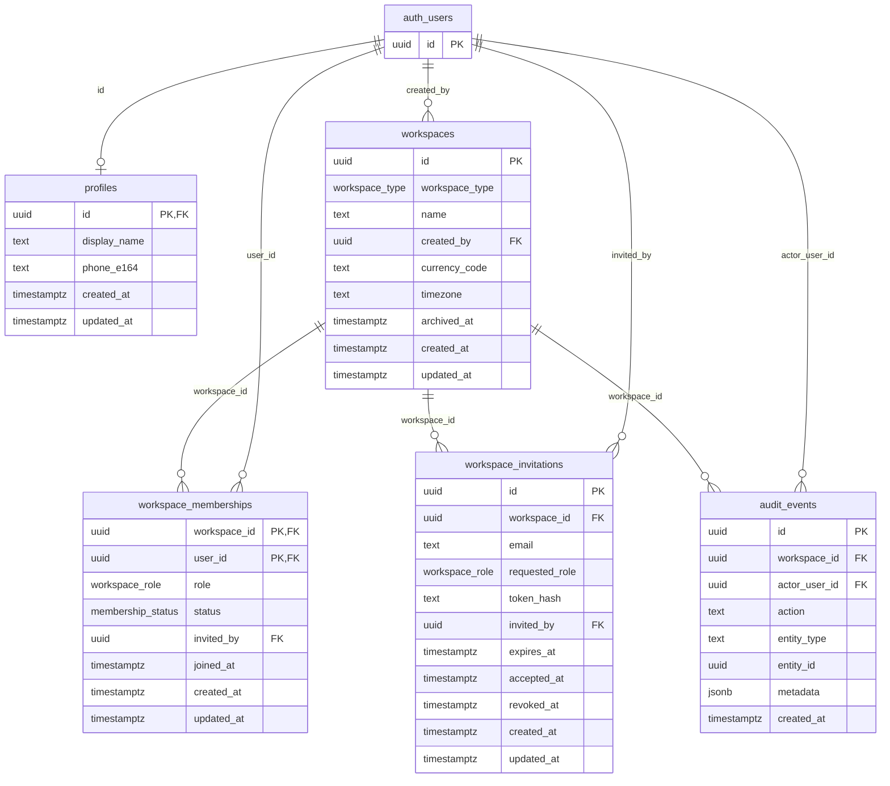

# Workspace Schema Review — Mepa Ledger Stage 2

**Status:** Review only — **do not apply** until explicitly approved.  
**Migration file:** `supabase/migrations/0001_workspace_foundation.sql`  
**Branch:** `feature/workspace-foundation` (from approved auth commits `b18ff21`, `ce8fc48`)

---

## Purpose

This document supports human review of the first Supabase workspace-foundation migration before any SQL is executed against a live project. It defines the tenant boundary, membership roles, invitation model, audit trail, and Row Level Security (RLS) baseline for Mepa Ledger.

No React application changes, IndexedDB migration, or dashboard operations are included in this stage.

---

## Entity relationship diagram



---

## Enums

| Enum | Values | Notes |
|------|--------|-------|
| `public.workspace_type` | `individual`, `company` | Tenant kind; no extra company table in v1 |
| `public.workspace_role` | `owner`, `admin`, `member` | Membership-scoped; not global |
| `public.membership_status` | `active`, `invited`, `suspended` | Archive preferred over hard delete |

Enums are created idempotently via `DO … EXCEPTION WHEN duplicate_object` blocks for local inspection re-runs only. **Tables, indexes, and policies are fail-fast (no `IF NOT EXISTS`) — production must run exactly once via Supabase migration tooling.**

---

## Security review (Stage 2 audit)

### Constraints verified in SQL

| Table | PK | FKs | NOT NULL | CHECK / unique indexes |
|-------|----|-----|----------|------------------------|
| `profiles` | `id` | → `auth.users` CASCADE | `created_at`, `updated_at` | display_name length; E.164 phone |
| `workspaces` | `id` | `created_by` → `auth.users` RESTRICT | type, name, created_by, currency, timezone, timestamps | name 1–120; currency `^[A-Z]{3}$`; timezone length |
| `workspace_memberships` | `(workspace_id, user_id)` | workspace, user, optional inviter | role, status, timestamps | active ⇒ `joined_at` set; **one active owner** partial unique |
| `workspace_invitations` | `id` | workspace, inviter | email, role, token_hash, expires_at, timestamps | email normalized; **role ≠ owner**; token_hash ≥ 32; expires > created; accept/revoke exclusive; **one pending invite per email/workspace** partial unique |
| `audit_events` | `id` | workspace, optional actor | action, entity_type, metadata, created_at | action/entity_type length; metadata is JSON object |

### RLS

- **Enabled + FORCE ROW LEVEL SECURITY** on all five `public` tables.
- **No** `USING (true)` or `WITH CHECK (true)` policies.
- Cross-workspace reads require `is_*` helper to confirm **active membership in that same `workspace_id`**; passing another workspace’s UUID returns false.
- **Archived workspaces:** `workspaces_select_active_members` requires `archived_at IS NULL`, so archived rows are hidden from all roles via client API (including owner) until a future owner-only archived policy is added.

### SECURITY DEFINER helpers and `create_workspace`

| Function | `search_path` | User identity | PUBLIC revoked | Grant |
|----------|---------------|---------------|----------------|-------|
| `set_updated_at` | `public` | N/A (trigger) | Yes | none (trigger-only) |
| `is_active_workspace_member` | `public` | **`auth.uid()` only** | Yes | `authenticated` EXECUTE |
| `is_workspace_owner` | `public` | via helper | Yes | `authenticated` EXECUTE |
| `is_workspace_admin_or_owner` | `public` | via helper | Yes | `authenticated` EXECUTE |
| `create_workspace` | `public` | **`auth.uid()` only** | Yes | `authenticated` EXECUTE |

**RLS recursion:** Policies on `workspace_memberships` call `is_workspace_admin_or_owner(workspace_id)`, which calls `is_active_workspace_member`, which `SELECT`s from `workspace_memberships`. This does **not** recurse through RLS because the helpers are **`SECURITY DEFINER` owned by the migration role** (typically `postgres`), and that owner **bypasses RLS** on the membership lookup. The helper never accepts a client-supplied user ID.

**`create_workspace` atomicity:** Single PL/pgSQL function ⇒ one transaction. Rejects unauthenticated callers (`42501`), blank/overlong names (`22023`), inserts workspace + exactly one active owner membership + one `workspace.created` audit event, then returns UUID. Failure rolls back all three inserts.

### Direct client writes denied

| Table | INSERT grant | UPDATE grant | DELETE grant | RLS write policies |
|-------|--------------|--------------|--------------|-------------------|
| `workspaces` | none | `authenticated` (owner policy only) | none | no INSERT/DELETE policies |
| `workspace_memberships` | none | none | none | none |
| `workspace_invitations` | none | none | none | none |
| `audit_events` | none | none | none | none |

Default Supabase table grants to `anon`/`authenticated` are **revoked** first, then least-privilege grants re-applied.

### Invitations — what the database does and does not enforce

| Rule | DB enforcement | Notes |
|------|----------------|-------|
| No owner invitations | **Yes** — `requested_role IN ('admin','member')` | |
| No accept after revoke | **Yes** — `revoked_at IS NULL OR accepted_at IS NULL` | Future accept function must still check before UPDATE |
| No duplicate pending invite same email | **Yes** — partial unique on `(workspace_id, email)` where pending | |
| Expiry at accept time (`expires_at > now()`) | **No** — CHECK cannot use volatile `now()` on UPDATE | **Must** be enforced in future `accept_workspace_invitation()` |
| 7-day TTL at invite creation | **No** — set in future invite function | DB only requires `expires_at > created_at` |

### Audit metadata secrets

**Not database-enforced.** Only `jsonb_typeof(metadata) = 'object'` is checked. A comment documents the convention forbidding passwords, tokens, keys, and payment secrets. **Do not claim DB-level secret prevention is complete.**

### Run-once / fail-fast operational rule

| Statement class | Behavior on re-run |
|-----------------|-------------------|
| `CREATE TYPE` (DO blocks) | Swallows duplicate (inspection only) |
| **`CREATE TABLE` / `CREATE INDEX` / `CREATE TRIGGER`** | **Errors immediately** if object exists |
| `CREATE OR REPLACE FUNCTION` | Replaces (review re-runs only) |

**If a migration fails mid-file:** do not re-run manually on production. Restore from backup or drop the partial `public` workspace objects on **staging only**, then apply once via Supabase CLI. `CREATE TABLE IF NOT EXISTS` was removed because it can hide a partial/broken schema.

---

## Keys, constraints, and checks

### `public.profiles`

| Item | Definition |
|------|------------|
| PK | `id` → `auth.users(id)` ON DELETE CASCADE |
| Checks | Optional `display_name` length 1–120; optional E.164 `phone_e164` |
| Excluded | No password, token, or secret columns |

### `public.workspaces`

| Item | Definition |
|------|------------|
| PK | `id` (UUID, `gen_random_uuid()`) |
| FK | `created_by` → `auth.users(id)` ON DELETE RESTRICT |
| Defaults | `currency_code = 'GHS'`, `timezone = 'Africa/Accra'` |
| Checks | Name trimmed length 1–120; `currency_code` three uppercase letters |
| Archive | `archived_at` nullable; prefer archive over delete |

### `public.workspace_memberships`

| Item | Definition |
|------|------------|
| PK | `(workspace_id, user_id)` |
| FKs | `workspace_id`, `user_id`, optional `invited_by` |
| Unique | Partial unique index: one **active owner** per workspace |
| Check | Active memberships require `joined_at IS NOT NULL` |
| Index | `(user_id, status)` for session workspace resolution |

### `public.workspace_invitations`

| Item | Definition |
|------|------------|
| PK | `id` |
| Unique | `token_hash` (store hash only, never raw token) |
| Role check | `requested_role IN ('admin', 'member')` — **never owner** |
| Email | Lowercase normalized in DB check |
| Expiry | `expires_at > created_at` at insert; **accept-time `expires_at > now()` enforced only in future accept function** |
| Revocation | Cannot be both accepted and revoked; no accept after revoke |
| Pending duplicate | Partial unique on `(workspace_id, email)` where not accepted/revoked |

### `public.audit_events`

| Item | Definition |
|------|------------|
| PK | `id` |
| FK | `workspace_id`, optional `actor_user_id` |
| Metadata | JSON object only; **convention forbids secrets — not enforced by database constraints or triggers** |

---

## Role model (product rules reflected in schema)

| Capability | Owner | Admin | Member |
|------------|-------|-------|--------|
| Read own profile | Yes | Yes | Yes |
| Read workspace (active, not archived) | Yes | Yes | Yes |
| Update workspace settings | Yes | No (v1) | No |
| Read workspace membership roster | Yes | Yes | Own only |
| Manage members (future functions) | Yes (all roles) | Yes (members only; not owners/admins) | No |
| Transfer ownership | Future audited op | No | No |
| Read invitations | Yes | Yes | No |
| Create invitations (future) | Yes | Yes | No |
| Read audit events | Yes | Yes | No |
| Ordinary ledger work (future tables) | Yes | Yes | Yes |

Admins **must not** promote themselves, transfer ownership, or manage owners/other admins in v1 — enforced by **absence of client write policies** plus future SECURITY DEFINER functions with explicit role checks.

---

## RLS policy matrix

RLS is **enabled on all five tables**. No `USING (true)` or `WITH CHECK (true)` policies.

| Table | SELECT | INSERT | UPDATE | DELETE |
|-------|--------|--------|--------|--------|
| `profiles` | Self (`id = auth.uid()`) | Self only | Self only | Denied (cascade via auth.users) |
| `workspaces` | Active members; non-archived | **Denied** (use `create_workspace`) | Owner only | **Denied** |
| `workspace_memberships` | Self **or** admin/owner of workspace | **Denied** | **Denied** | **Denied** |
| `workspace_invitations` | Admin/owner of workspace | **Denied** | **Denied** | **Denied** |
| `audit_events` | Admin/owner of workspace | **Denied** | **Denied** | **Denied** |

### Membership helpers (SECURITY DEFINER)

| Function | Purpose | Recursion avoidance |
|----------|---------|---------------------|
| `is_active_workspace_member(workspace_id, roles[])` | Core membership test using `auth.uid()` | **`SECURITY DEFINER` owner bypasses RLS** on direct `workspace_memberships` read; no policy recursion |
| `is_workspace_owner(workspace_id)` | Owner-only checks | Wrapper over helper with `owner` role |
| `is_workspace_admin_or_owner(workspace_id)` | Admin + owner checks | Wrapper over helper |

All helpers use `SET search_path = public` and never accept a client-supplied user ID.

---

## Trusted function: `create_workspace`

**Signature:** `create_workspace(workspace_name text, requested_type workspace_type) → uuid`

| Requirement | Implementation |
|-------------|----------------|
| Authentication | Requires `auth.uid()`; raises `42501` if missing |
| Name validation | Trim; length 1–120 |
| Atomicity | Single PL/pgSQL function: workspace + owner membership + audit event |
| Initial owner | Exactly one `owner` / `active` membership for caller |
| Client user ID | **Not accepted**; always uses `auth.uid()` |
| Audit | Inserts `workspace.created` event with non-sensitive metadata |
| Grants | `EXECUTE` granted to `authenticated` only |

Writes bypass RLS because the function is `SECURITY DEFINER` owned by the migration role (typically `postgres` / Supabase service owner). This is intentional and must be reviewed before production apply.

---

## PostgreSQL / Supabase caveats (review before apply)

1. **`pgcrypto` / `gen_random_uuid()`** — Migration ensures `pgcrypto` in `extensions` schema (standard on Supabase). Confirm in target project before apply.
2. **`CREATE TABLE` without `IF NOT EXISTS`** — Re-run fails fast if objects exist. Treat as **run-once** via Supabase migration tooling only (see Security review section).
3. **Archived workspaces** — SELECT policy requires `archived_at IS NULL`; archived rows are not readable via client API for any role in v1.
4. **Profile bootstrap** — Users may insert their own profile row; a future auth hook may auto-create profiles on signup.
5. **Invitation accept/expiry** — Revoked and duplicate-pending invites are DB-constrained; **expired accept and 7-day TTL require future SECURITY DEFINER functions** (CHECK cannot use `now()` on update).
6. **SECURITY DEFINER ownership** — Functions must remain owned by a privileged role; avoid transferring ownership to `authenticated`. `service_role` bypasses RLS by design in Supabase.
7. **No ledger tables yet** — Contacts, obligations, payments remain in IndexedDB until a later migration stage adds pesewas-based ledger tables scoped by `workspace_id`.
8. **Email confirmation users** — Membership FK to `auth.users` requires user to exist before membership insert (invitation acceptance flow handles this).
9. **Audit metadata** — Secret exclusion is **application/trusted-function convention only**; no DB enforcement in this migration.

---

## SQL that must NOT be run until explicitly approved

Do **not** execute the following against any Supabase project until review sign-off:

```text
-- Entire migration file:
supabase/migrations/0001_workspace_foundation.sql

-- Including specifically:
CREATE EXTENSION … pgcrypto
CREATE TYPE public.workspace_type …
CREATE TYPE public.workspace_role …
CREATE TYPE public.membership_status …
CREATE TABLE public.profiles …
CREATE TABLE public.workspaces …
CREATE TABLE public.workspace_memberships …
CREATE TABLE public.workspace_invitations …
CREATE TABLE public.audit_events …
CREATE FUNCTION public.create_workspace …
CREATE FUNCTION public.is_active_workspace_member …
ALTER TABLE … ENABLE ROW LEVEL SECURITY
CREATE POLICY …
GRANT …
```

Also **do not** run ad-hoc `INSERT` into `workspaces`, `workspace_memberships`, `workspace_invitations`, or `audit_events` from the SQL editor or client SDK until dedicated trusted functions exist.

---

## Unresolved risks for reviewer attention

| Risk | Severity | Mitigation path |
|------|----------|-----------------|
| Admin roster visibility exposes all member emails/roles | Medium | Accept for v1 admin UI; narrow columns in API layer later |
| No automated test of SQL policies in CI yet | Medium | Add pgTAP or Supabase local stack in a future stage |
| `create_workspace` callable by any authenticated user without billing/plan limits | Low | Add quota function before public launch |
| Partial unique owner index does not prevent suspended owner + new owner race without transaction isolation review | Low | Future ownership transfer function must lock workspace row |
| Metadata JSON convention is **not DB-enforced** | **High (documented)** | Trusted functions + app lint; optional trigger in later migration |
| Invitation expiry at accept time **not DB-enforced** | **Medium (documented)** | Future `accept_workspace_invitation()` must check `expires_at > now()` |
| `service_role` key bypasses all RLS | **High (platform)** | Never expose service role in frontend; use only in server/admin tooling |
| Owner cannot read archived workspace via client API in v1 | Low | Add owner archived SELECT policy when archive UX is built |

---

## Next stage (out of scope here)

- Apply migration to staging Supabase project after approval
- Replace “Workspace setup pending” UI with workspace creation flow calling `create_workspace`
- Add invitation and membership management SECURITY DEFINER functions
- Add ledger tables (`workspace_id`, amounts in pesewas) and scoped RLS
- IndexedDB → Supabase data migration
